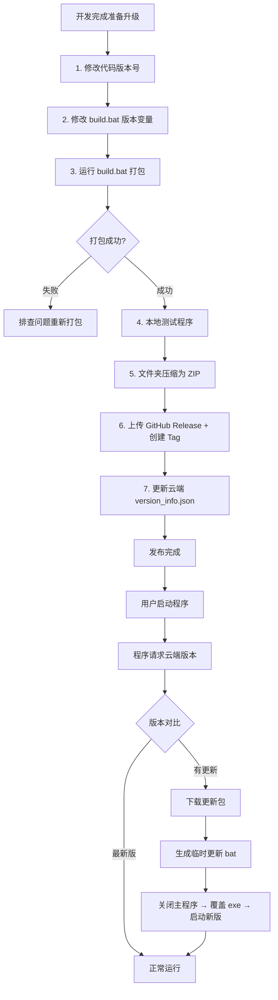

# 桥梁监测上位机 - 问题排查、修复 & 发布全流程手册 V1.0

## 适用程序
- PyQt5 + pyqtgraph 桥梁监测上位机

## 涉及功能
- 自动更新
- 一键打包
- 版本管理
- Windows 批处理
- PyInstaller 打包优化目录

---

## 1. 项目整体架构

### 1.1 文件说明

| 文件名 | 功能说明 |
| --- | --- |
| `gyro_bridge_full.py` | 主程序（PyQt5 上位机） |
| `version_info.json` | 云端版本配置，用于在线版本检测 |
| `config.json` | 本地业务配置文件 |
| 临时 `update.bat` | 程序运行时动态生成，用于覆盖更新 |
| `build.bat` | 一键打包、清理、发布脚本 |

### 1.2 自动更新核心流程

程序启动 → 读取本地版本号 → 请求云端 `version_info.json` → 版本对比

- 已是最新版 → 正常运行
- 存在新版本 → 下载更新包 → 生成临时批处理脚本 → 关闭主程序 → 覆盖 exe → 启动新版本

---

## 2. 全流程问题汇总 & 逐案修复

### 问题 1：更新后反复提示更新（死循环）

**现象**
- 程序已完成更新覆盖，但重启后依旧提示新版本，循环触发更新。

**根因**
- 初始方案将版本号存放在 `config.json`
- 更新逻辑仅替换 exe，不会修改配置文件
- 本地版本号仍为旧值，版本比对判定一直需要更新

**修复方案**
- 将版本号硬编码到 Python 代码内部，跟随 exe 一同更新
- 删除配置文件中冗余版本字段

**错误写法**
```python
import json

with open("config.json", "r", encoding="utf-8") as f:
    APP_CONFIG = json.load(f)

CURRENT_VERSION = APP_CONFIG.get("current_version", "1.4.0")
```

**正确写法**
```python
# 版本号随 exe 更新，彻底解决循环提示
CURRENT_VERSION = "1.6.0"
```

### 问题 2：更新脚本中文乱码、执行闪退

**现象**
- 更新时弹出 CMD 黑框、文字乱码，脚本直接闪退，更新中断。

**根因**
- Windows 批处理默认编码为 GBK
- 脚本包含中文、Emoji、特殊符号，GBK 无法解析
- 编码不匹配导致系统识别为无效脚本

**解决方案**
- 更新脚本全部使用纯英文，移除中文与特殊符号
- 代码写入 bat 文件时，强制指定 `encoding="gbk"`
- 保证脚本语法标准、无多余特殊字符

### 问题 3：更新成功但提示 `The batch file cannot be found`

**现象**
- 文件复制、程序更新均正常，最后 CMD 报错：`The batch file cannot be found`。

**根因**
- 脚本内部存在自删除逻辑
- 执行过程中脚本删除自身后，系统继续执行代码，因文件不存在抛出提示

**解决方案**
- 移除脚本自我删除代码
- 仅清理下载的更新包，让脚本正常执行完毕

### 问题 4：打包脚本版本号硬编码，维护繁琐

**现象**
- `build.bat` 中版本号、文件夹名、发布说明写死
- 升级版本需手动修改多处，易漏改、版本不一致

**解决方案**
- 脚本顶部定义唯一版本变量 `set NEW_VERSION=xxx`
- 全文使用 `%NEW_VERSION%` 动态引用，改一处全局生效

### 问题 5：程序启动弹出 CMD 黑框

**现象**
- 双击 exe 先弹出黑色控制台窗口，再显示 GUI 界面

**根因**
- PyInstaller 默认控制台模式，适用于命令行程序
- GUI 程序需要窗口模式

**解决方案**
- 打包命令增加参数 `--windowed`（简写 `-w`）
- 该参数不影响运行时动态生成的更新 bat 脚本

### 问题 6：打包后丢失配置文件、旧文件堆积

**现象**
- 多次打包后 `build/`、`dist/`、`.spec` 文件残留，引发打包冲突
- 打包完成后 `config.json` 未被带入发布目录，程序运行报错

**解决方案**
- 打包前自动清理旧目录与旧 `.spec` 文件
- 打包完成后自动复制 `config.json` 到发布目录

---

## 3. 最终稳定版代码

### 3.1 云端版本配置文件 `version_info.json`

部署在远程地址，用于在线版本校验。

```json
{
  "version_check_url": "https://raw.githubusercontent.com/czz-could/qlsd/refs/heads/main/version_info.json",
  "check_on_startup": true,
  "current_version": "1.6.0"
}
```

### 3.2 Python 主程序版本定义

```python
# 全局版本号，跟随 exe 更新，杜绝更新死循环
CURRENT_VERSION = "1.6.0"
```

### 3.3 Python 自动更新函数（最终版）

```python
def install_update(self, file_path):
    import os
    import sys
    import tempfile
    import time
    from PyQt5.QtWidgets import QApplication

    exe_path = sys.executable
    temp_dir = tempfile.gettempdir()
    bat_path = os.path.join(temp_dir, "update.bat")

    # 纯英文脚本，兼容 Windows GBK 编码
    bat_content = '''@echo off
chcp 65001 > nul
echo Installing update, please wait...
ping 127.0.0.1 -n 3 > nul

copy /y "{file_path}" "{exe_path}"
start "" "{exe_path}"
del /f /q "{file_path}" > nul 2>&1
exit
'''.format(file_path=file_path, exe_path=exe_path)

    # 强制 GBK 编码写入，解决乱码
    with open(bat_path, "w", encoding="gbk") as f:
        f.write(bat_content)

    # 执行更新脚本
    os.system(f'start "" "{bat_path}"')
    time.sleep(1.5)
    QApplication.quit()
```

### 3.4 一键打包发布脚本 `build.bat`

功能：自动清理、动态版本、关闭黑框、复制配置、生成发布说明。

```bat
@echo off
chcp 65001 >nul
mode con cols=80 lines=25
echo ======================================
echo      Auto Build Script
echo ======================================
echo.

:: ========== 仅在此处修改版本号 ==========
set NEW_VERSION=1.6.0
:: =======================================

echo [1/5] Cleaning old files...
rmdir /s /q build 2>nul
rmdir /s /q dist 2>nul
del /f /q *.spec 2>nul
echo OK.
echo.

echo [2/5] Building v%NEW_VERSION% ...
echo Please wait...
echo.

:: --windowed 关闭黑框 | --onedir 目录打包 | 补充隐式依赖
echo y | pyinstaller --onedir --windowed ^
    --name "BridgeMonitor_v%NEW_VERSION%" ^
    --hidden-import PyQt5.sip ^
    --hidden-import pyqtgraph ^
    gyro_bridge_full.py

echo.
if %ERRORLEVEL% EQU 0 (
    echo [3/5] Build successful!
    echo.

    echo [4/5] Copying config file...
    copy /y config.json "dist\BridgeMonitor_v%NEW_VERSION%\config.json" >nul
    if exist "dist\BridgeMonitor_v%NEW_VERSION%\config.json" (
        echo OK.
        echo.

        echo [5/5] Generating release notes...
        echo ======================================== > dist\release_note.txt
        echo   Release Note >> dist\release_note.txt
        echo ======================================== >> dist\release_note.txt
        echo. >> dist\release_note.txt
        echo Version: v%NEW_VERSION% >> dist\release_note.txt
        echo Output: dist\BridgeMonitor_v%NEW_VERSION%\ >> dist\release_note.txt
        echo. >> dist\release_note.txt
        echo Steps: >> dist\release_note.txt
        echo   1. Compress the folder to .zip >> dist\release_note.txt
        echo   2. Upload to GitHub Release ^(Tag: v%NEW_VERSION%^) >> dist\release_note.txt
        echo   3. Update download_url in version_info.json >> dist\release_note.txt
        echo. >> dist\release_note.txt
        echo   Tip: Change version number at line 9 in this script >> dist\release_note.txt

        echo OK: dist\release_note.txt
        echo.
        echo ======================================
        echo   BUILD SUCCESS!
        echo   Output: dist\BridgeMonitor_v%NEW_VERSION%\
        echo   Note: dist\release_note.txt
        echo ======================================
    ) else (
        echo ERROR: Config file copy failed!
        echo    Manual: copy config.json "dist\BridgeMonitor_v%NEW_VERSION%\config.json"
    )
) else (
    echo Build FAILED!
)
pause
```

---

## 4. 版本升级 & 发布标准流程

### 4.1 日常操作步骤

1. 修改 Python 代码内版本号 `CURRENT_VERSION = "x.x.x"`
2. 修改 `build.bat` 中版本变量 `set NEW_VERSION=x.x.x`
3. 双击运行 `build.bat` 执行一键打包
4. 进入 `dist` 目录本地测试：
   - 程序无 CMD 黑框
   - `config.json` 存在且正常加载
   - 功能运行正常
5. 将发布文件夹压缩为 `.zip` 包
6. 上传压缩包至 GitHub Release，并创建对应版本 Tag
7. 更新云端 `version_info.json`：修改最新版本号 + 新版下载地址
8. 发布完成，用户端自动更新生效

### 4.2 发布与更新流程图



---

## 5. 核心知识点与避坑清单

### 5.1 自动更新设计原则

- 版本号必须写在代码内，禁止存放于外部配置文件
- Windows 批处理默认编码 GBK，动态生成 bat 要求：纯英文 + 强制 GBK 写入
- 程序无法自我覆盖，必须借助外部 bat 脚本完成替换

### 5.2 PyInstaller 关键参数

- `--windowed` / `-w`：GUI 程序必加，关闭控制台黑框
- `--onedir`：目录式打包，文件结构清晰、启动速度快
- `--hidden-import`：手动补充隐式依赖，防止运行报错

### 5.3 批处理脚本要点

- 使用变量管理版本，一处修改全局同步
- 打包前清理 `build / dist / .spec`，避免旧文件干扰
- 非代码资源（如 `config.json`）需要手动复制，PyInstaller 不会自动打包

### 5.4 常见问题速查表

| 现象 | 原因 | 解决方案 |
| --- | --- | --- |
| 更新后反复提示更新 | 版本号存于外部配置 | 版本号硬编码到 Python 代码 |
| 更新脚本乱码、闪退 | 含中文 / 编码不匹配 | 纯英文脚本 + GBK 编码写入 |
| 提示 `The batch file cannot be found` | 脚本自删除 | 移除脚本自删除代码 |
| 启动程序弹出黑框 | 未加 `--windowed` 参数 | PyInstaller 追加 `--windowed` |
| 打包后找不到 `config.json` | 未复制配置文件 | 打包后执行 `copy` 命令拷贝 |

---

## 6. 后续迭代优化建议

### 建议 1：区分两套打包脚本

- 正式版：`build_release.bat`（带 `--windowed`，对外发布）
- 调试版：`build_debug.bat`（不带 `--windowed` 参数，方便查看日志排错）

### 建议 2：版本联动优化

- 统一维护单一版本文件，实现代码、打包脚本、云端配置三端版本自动同步
- 减少手动修改，避免版本不一致

### 建议 3：更新体验增强

- 增加更新进度提示、静默更新、更新失败回滚机制
- 提升用户体验和稳定性

---

## 7. 使用说明

1. 新建文本文档，将以上内容粘贴进去
2. 重命名文件，后缀改为 `.md`（例如：`上位机更新与打包手册.md`）
3. 使用 Typora、VS Code、记事本 ++ 等软件打开查看、编辑
